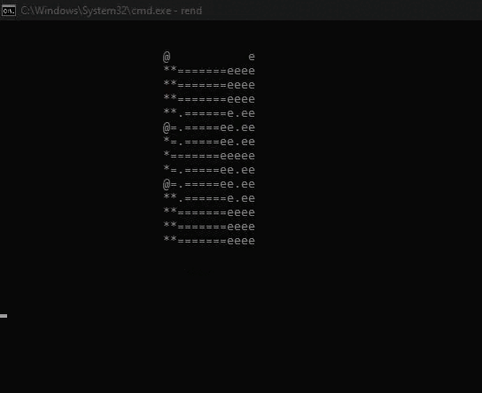

# asciigl

A command-line interface 3D ASCII renderer, written in C.

## Features

- 3D model rendering in perspective projection
- Ambient & diffuse lighting
- Dynamic lights (Point and spot lights)
- Model textures
- In-built .bmp textures and .obj models loading

More features are planned, currently work in progress.
